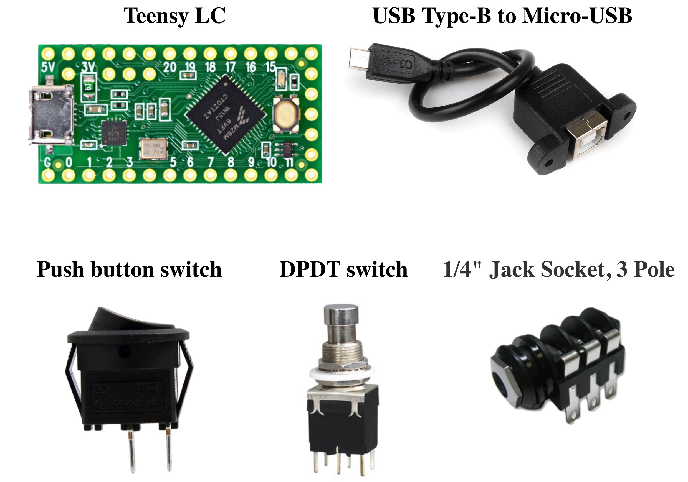
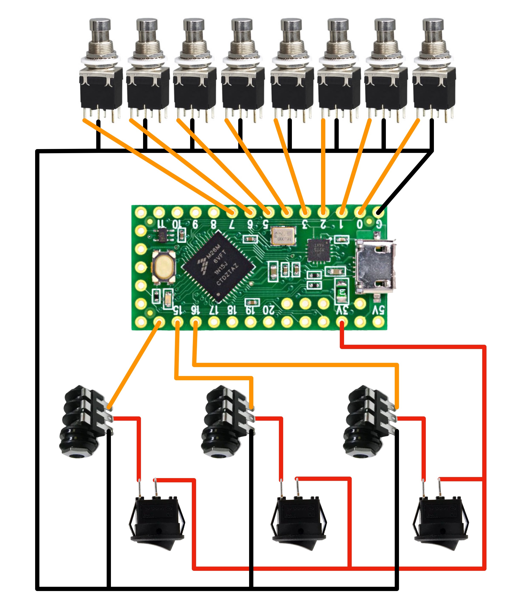

# ROCK STORMER

This is a project of making MIDI footswitch for Guitar Rig 6.

### Parts list

* Teensy LC - 1
* USB Type-B to Micro-USB - 1
* DPDT switch - 8
* Push button switch - 3
* 1/4" Jack Socket, 3 Pole - 3

### Scheme

